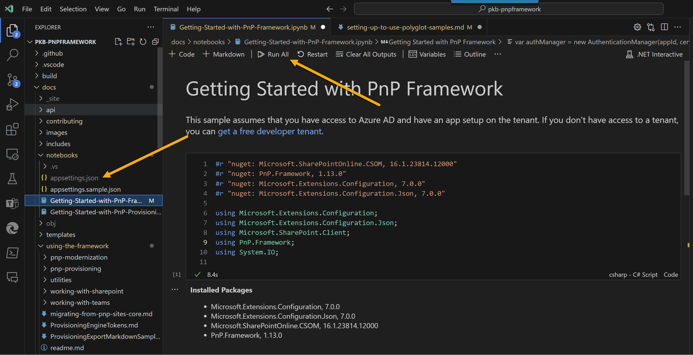

# Setting up to run the Polyglot Notebooks

The Polyglot Notebooks are a great way to get started with the PnP Framework, with runnable samples and you can adjust the code and explore the framework. There are a few things you need to do to get started.

## Prerequisites

- [Visual Studio Code](https://code.visualstudio.com/)
- [Install .Net 7 SDK](https://dotnet.microsoft.com/en-us/download)
- [.NET Interactive Notebooks Extension](https://marketplace.visualstudio.com/items?itemName=ms-dotnettools.dotnet-interactive-vscode)

## Configuring the Notebooks for your tenant

The Polyglot Notebooks are designed to be run against your tenant, but you will need to configure these settings file to do this.

### Settings File

 For these notebooks, we are using the PnP Framework to authenticate with SharePoint using the certificate. You will need to create an Azure AD App Registration and generate a certificate, assign permissions to SharePoint within the app.

To setup the app quickly, we recommend using PnP PowerShell to create the app registration and certificate - https://pnp.github.io/powershell/articles/authentication.html

To keep credentials away from the PolyGlot Notebooks, we have setup a seperate file to contain these, copy the `appsettings.sample.json` file to `appsettings.json` and update the values to match your environment.

```json
{
    "azureAppId":"<app-id>",
    "certificatePassword":"<cert-password>",
    "certificatePath":"C:\\temp\\PolyGlot\\pnpframework-polyglot.pfx",
    "azureTenantName":"contoso.onmicrosoft.com",
    "siteUrl" : "https://contoso.sharepoint.com/sites/contoso"
}

```

Complete each variable in the `appsettings.json` file with the following values:

- **azureAppId**: This variable represents the Azure AD App ID. You will need to create an Azure AD App Registration and obtain the App ID for your application.
- **certificatePassword**: This variable represents the password for the certificate used by the Azure AD App Registration. You will need to generate a certificate and provide the corresponding password.
- **certificatePath**: This variable represents the file path to the certificate used by the Azure AD App Registration. You will need to provide the correct file path where the certificate is located on your system.
- **azureTenantName**: This variable represents the name of your Azure AD tenant. You will need to provide the name of your Azure AD tenant (e.g., contoso.onmicrosoft.com).
- **siteUrl**: This variable represents the URL of your SharePoint site. You will need to provide the URL of your SharePoint site (e.g., https://contoso.sharepoint.com/sites/contoso).

Make sure to replace app-id, cert-password, and other placeholder values with the actual values specific to your environment.


## Running the Notebooks

Once you have configured the settings file, navigate to the [PnP Framework | GitHub](https://github.com/pnp/pnpframework) repository, ensure you have setup a local version with git clone and open the `docs/notebooks` folder in Visual Studio Code. You will find some sample notebooks in this folder. Open the notebook you want to run and click the "Run All Cells" button to run the entire notebook. You can also run individual cells by clicking the "Run Cell" button.



Overtime these samples will grow and you can explore the framework, experiment and learn how to use the PnP Framework within your own projects.

## Updating the version of PnP Framework

```dotnetcli
#r "nuget: PnP.Framework, 1.13.xx-nightly"
```

The code #r "nuget: PnP.Framework, 1.13.xx-nightly" is using the dotnetcli language specifier to specify a NuGet package reference in a .NET Interactive Notebook. It is referencing the PnP.Framework package with version 1.13.xx-nightly. This code is instructing the notebook to import the PnP.Framework package, making its functionality available for use in the notebook.

This may not reflect the latest version of the PnP Framework, so you can update the version of the PnP Framework by changing the version number in the code. You can find the latest version of the PnP Framework on the [PnP.Framework Package | Nuget](https://www.nuget.org/packages/PnP.Framework) page.

